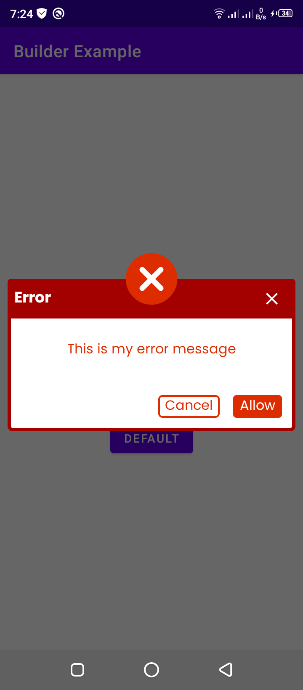
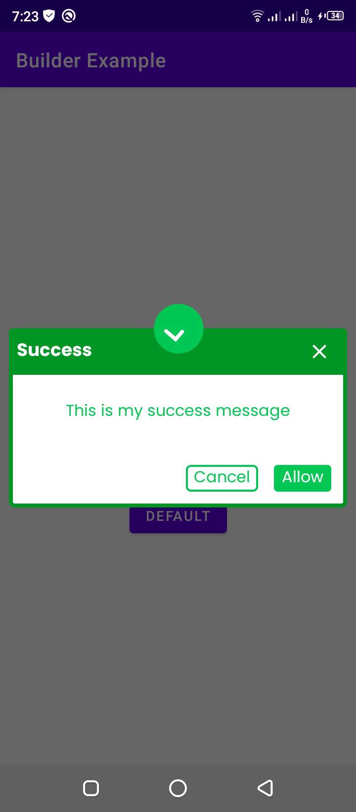
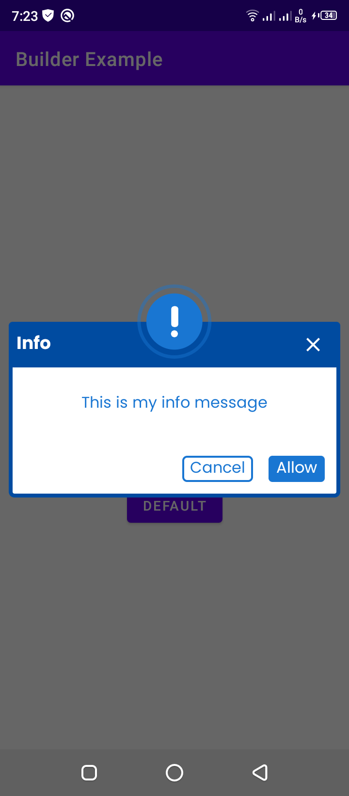

# FunSolAlertDialog




## A fancy animated alert dialog which is able to show 3 kinds of dialogs
### 1. Success Dialog
### 2. Info Dialog
### 3. Error Dialog

## How to include in your project

### Step1: Add it in your root build.gradle at the end of repositories:
`allprojects {
		repositories {
			...
			maven { url 'https://jitpack.io' }
		}
	}` 
  
  ### Step 2. Add the dependency
  `

	dependencies {
	        implementation 'com.github.farimarwat:FunSolAlertDialog:1.1'
	}

`
### Usage:

```
val dialog = FunSolDialog.Builder(this)
            .setTitle("Funsol")
            .setMessage("This message is from funsol tech")
            .setDialogType(FunSolDialog.TYPE_SUCCESS)
            .setPositive("Allow",object :FunSolDialog.FunSolDialogButtonClickListener{
                override fun onButtonClicked(dialog: AlertDialog) {

                }
            })
            .build()
        dialog.show()
```
